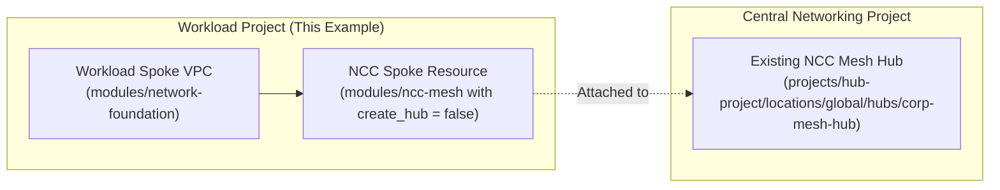

# GCP Terraform Example: NCC Mesh - Spoke Attachment

This example demonstrates how to attach a newly created or existing **spoke VPC** to an **already-existing Network Connectivity Center (NCC) Mesh Hub** using the `modules/ncc-mesh` module with `create_hub = false`.

This pattern is designed for decentralized, multi-project workflows where:
1. The centralized **NCC Hub** was already provisioned in a central/hub networking project.
2. A separate workload project needs to provision its own VPC and attach it as a spoke to that central hub without managing or recreating the hub resource.

---

## Architecture & Workflow



---

## Modules Called

- **`module.spoke_vpc`**: Source `"../../../modules/network-foundation"` (Creates 3-tier DMZ, App, and Data subnets)
- **`module.ncc_spoke`**: Source `"../../../modules/ncc-mesh"` (Attaches spoke to existing hub with `create_hub = false`)

---

## Prerequisites

- **Terraform**: `>= 1.3`
- **Existing NCC Mesh Hub**: An active NCC Mesh Hub must already exist in the central networking project.
- **Auto-Accept Configuration / Permissions**:
  - The central NCC Hub's `default` group should have `auto_accept_projects` containing the spoke project ID (or the spoke must be accepted by an admin in the hub project).
  - The deploying identity must have `roles/networkconnectivity.hubAdmin` on the hub or permission to create spokes bound to that hub.

---

## Usage & Execution Steps

```bash
# 1. Change directory to this example
cd examples/ncc-mesh/spoke-attachment

# 2. Create a terraform.tfvars file with your project IDs
cat <<EOF > terraform.tfvars
spoke_project_id = "YOUR_WORKLOAD_PROJECT_ID"
hub_project_id   = "YOUR_HUB_PROJECT_ID"
ncc_hub_name     = "corp-mesh-hub"
EOF

# 3. Initialize Terraform plugins and backend
terraform init

# 4. Generate and review execution plan
terraform plan

# 5. Apply infrastructure changes
terraform apply

# 6. Destroy provisioned resources (when finished testing)
terraform destroy
```

---

## Inputs

| Name | Description | Type | Default | Required |
|------|-------------|------|---------|:--------:|
| `spoke_project_id` | The GCP project ID where the spoke VPC and spoke resource are created. | `string` | n/a | **Yes** |
| `hub_project_id` | GCP project ID where the existing NCC Hub resides. | `string` | `null` | No |
| `ncc_hub_name` | Name of the existing NCC Mesh Hub. | `string` | `"corp-mesh-hub"` | No |
| `ncc_hub_id` | Direct URI/ID of the existing NCC Hub. | `string` | `null` | No |
| `spoke_name` | Name of the spoke resource attached to the hub. | `string` | `"workload-app-spoke"` | No |
| `spoke_vpc_name` | Name of the spoke VPC network to create and attach. | `string` | `"workload-app-vpc"` | No |
| `environment` | Environment identifier (e.g. dev, uat, prod). | `string` | `"prod"` | No |
| `region` | GCP region for the spoke VPC subnets. | `string` | `"us-central1"` | No |
| `subnet_cidr_dmz` | CIDR block for the DMZ subnet. | `string` | `"10.120.0.0/24"` | No |
| `subnet_cidr_app` | CIDR block for the Application subnet. | `string` | `"10.120.1.0/24"` | No |
| `subnet_cidr_data` | CIDR block for the Data subnet. | `string` | `"10.120.2.0/24"` | No |

---

## Outputs

| Name | Description |
|------|-------------|
| `spoke_vpc_id` | The URI of the created spoke VPC network. |
| `spoke_vpc_name` | The name of the created spoke VPC network. |
| `ncc_hub_id` | The target NCC Mesh Hub ID that this spoke is attached to. |
| `vpc_spokes` | Created VPC spoke objects. |
| `spokes` | All created spoke objects prefixed with spoke type. |
